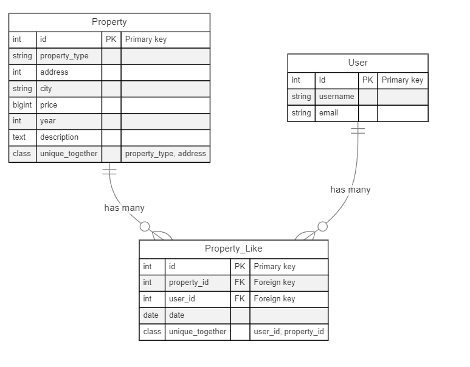

# HABI TEST

## Consulting service

### technologies used:
-  python 3.9
-  mysql-connector-python

the modules were separated depending on the functionality, which are as follows

### database
Establishes the DB connection and returns the cursor that can be used to interact with the DB.

### models

the DB queries are established, in this case the real estate query taking into account the established filters.

### app

an HTTP service was set up using BaseHTTPRequestHandler and HTTPServer from the native python http library, in which it is hosted on port 8000, taking into account the required urls, with its
which is hosted on port 8000, taking into account the required urls, with their expecion in case of a non-existent url.

### test

using the unittest library, different scenarios were created for the query service and the app in general.


### settings_local

this file was created to host all the sensitive constants of our project, this file is not uploaded to the repository
to avoid having for example credentials that can be used by third parties.

we need to create the settings_local.py file and place the credentials we want to use, as shown in the example:

```
HOSTNAME = ""
USER=""
PASSWORD = ""
DATABASE_NAME = ""
PORT = ""
```


for the self-documentation was used pydoc and generated the documentation in the docs folder.


## “Me gusta” service

In this service, I planned a table in which the property and user tables will be related, placing a date field for statistical purposes. 
field for statistical purposes. In this table there is a stored process to verify that the combination of porperty_id and user_id is unique. 
user_id is unique, this to avoid that a user has more than one like in the same property.



additionally in the property table we placed an additional field called porperty_type, in order to know what type of property is the one that is registered, if it is an apartment, house, etc., additionally, it has a stored process
property is the one that is registered, if it is an apartment, house, etc, additionally, it has a stored process to verify that the combination of property_type and address is unique.
to verify that the combination of property_type and address is unique, this to avoid that there are duplicate properties and at the moment of making the
duplicate properties and at the moment of making updates in other tables such as state, this is done to the registered property and not to create another
another record is not created

